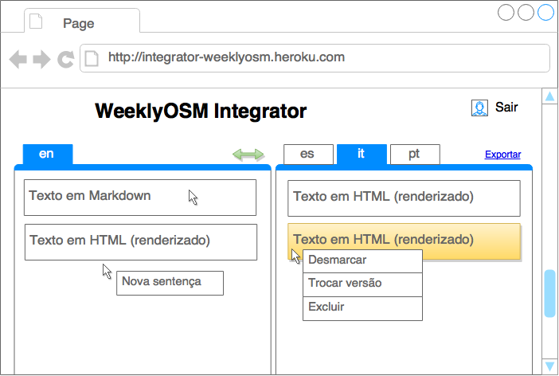

Se você ainda precisa saber o porquê deste documento, leia o [`/README.md`](../README.md).

**Atenção!** Não se pretende que os diagramas abaixo sejam "formais" ou completos. Com eles, quer-se apenas o encadeamento e a transmissão das ideias com o máximo de simplicidade e objetividade.

# Um novo fluxo de trabalho...

Toda a proposta resume-se em reunir os dois times numa única ferramenta muito simples de usar. Caso não seja possível, o documento Markdown que resulta do _clipping_ colaborativo em Rizzoma (ou outro ambiente) poderá simplesmente ser importado no integrador, de forma manual ou autommática.


Esse integrador gerenciaria todas as traduções em sentenças individuais, e possibilitaria a exportação dos documentos compilados, para [Wordpress com plugin](http://www.elegantthemes.com/blog/tips-tricks/using-markdown-in-wordpress) ou [GitHub Pages](https://pages.github.com/) via [Ruhoh](http://ruhoh.com/).

A seta larga no diagrama quer significar que todas as traduções saem do integrador como documentos prontos. Tal movimento dar-se-ia por COPIAR-COLAR de TXT integral, ou com REST (melhoria).

# Interface

A mais simples e fácil possível, de tela única. Inclusive o usuário sendo cadastrado mediante o envio, ao administrador, de sua senha criptografada em MD5.



Detalhamento:

1. Duas colunas, sendo uma para o idioma de referência e a outra para o idioma sendo traduzido;
1. Cada aba de uma coluna corresponde a um idioma de trabalho;
1. Cada aba é identificada por uma bandeira invés de um nome;
1. Cada aba teria uma ação "Export" e/ou "Sync (REST)";
1. O clique de botão esquerdo numa setença expõe seu código Markdown para edição;
1. Cada sentença Markdown seria renderizada em HTML mediante uma biblioteca Javascript;
1. Cada sentença seria criada, regravada, marcada ou apagada via [publish–subscribe](https://en.wikipedia.org/wiki/Publish%E2%80%93subscribe_pattern)
1. _Warnings_ e erros de validação apareceriam em [mensagens tipo os _toasts_ do Android](http://www.devmedia.com.br/exibindo-mensagens-no-android-com-a-classe-toast/26668)
1. Cada setença pode ser marcada como revisada ou validada;
1. O estilo dessas listas de setenças imitira o estilo do [Wunderlist](https://www.wunderlist.com/), inclusive fazendo uso de [_drag-and-drop_](https://pt.wikipedia.org/wiki/Drag-and-drop) para ordenação delas (cf. [Dragula](http://hackpedia.com.br/instale-um-sistema-simples-de-drag-and-drop-na-sua-aplicacao-com-o-dragula/) ou [HTML5](http://www.html5rocks.com/pt/tutorials/dnd/basics/))

# Web minimalista, um estilo diferente

Para o sistema ser extremamente simples e realmente muito barato, de tela única, não pode se responsabilizar por fluxos de configuração e gerência de dados. A figura de um administrador lida com dois arquivos JSON, um de configurações e outro de dados (renovado a cada semana).


Na verdade, o JSON de dados somente é útil como backup e ao final do fluxo, quando é exportado/transformado em um documento Markdown para cada idioma.

# Modelo de dados

Exemplo de arquivo de configuração:
```js
{
	site_name: "WeeklyOSM Integrator",
    languages:
    {
    	en: "English",
        pt: "Portuguese"
    },
    users:
    {
    	alexandre: "PASSWORDMD5SUMCODE",
        manfred: "PASSWORDMD5SUMCODE",
    },
    defaults:
    {
    	src: "en",
        dst: "pt"
    }
}
```

Exemplo de arquivo de traduções:
```js
{
    {
        en:
        {
            date: "2015-06-20 18:30:01",
            author: "manfred",
            text: "Translation text here, in Markdown"
        }
        pt:
        {
            date: "2015-06-20 19:20:11",
            author: "alexandre",
            text: "Translation text here, in Markdown"
        }
    }
}
```

# Softwares e tecnologias

- SaaS gratuito em Heroku ou OpenShift
- **Node.js** com solução de _pubsub_
- JSON para gerência e persistência de configurações e dados
- GitHub (este repositório na [OSMBrasil](https://github.com/OSMBrasil)) para:
  - Gerenciar o código
  - Desenvolver futuramente algum script auxiliar
  - Wiki de documentação
  - Issues

# Licença

Este plano e cada imagem que ele contém, na medida do que as ferramentas usadas para criá-los permite, estão em **domínio público** sob uma licença [CC0 1.0](https://creativecommons.org/publicdomain/zero/1.0/deed.pt_BR).